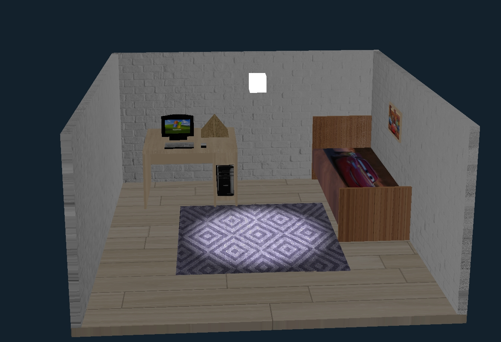
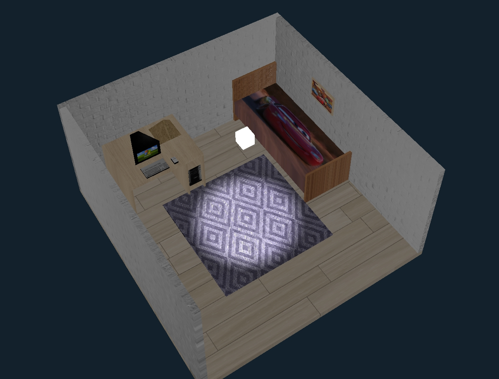
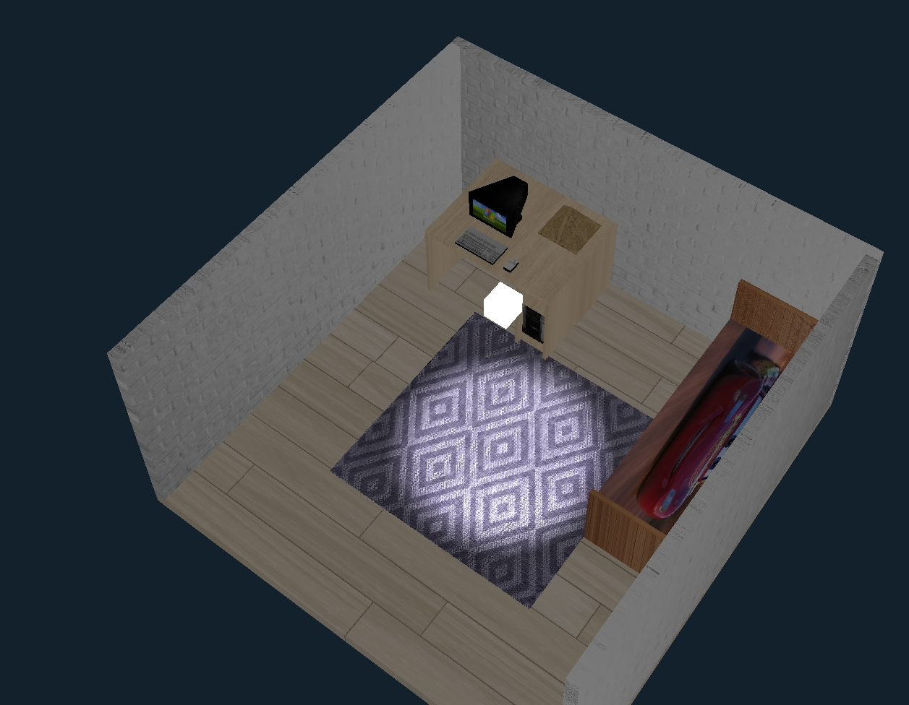

# Bilgisayar Grafikleri Projesi

Bu proje, Visual Studio kullanarak geliştirilen bir OpenGL uygulamasıdır. Proje, 3D grafikler ve sahne rendering işlemleri üzerine odaklanmaktadır. Kullanıcı, projeyi Visual Studio'da açıp doğrudan çalıştırabilir veya manuel olarak derleyebilir. <br> **Proje Videosu:** https://youtu.be/Jppn0Wltxt8

## Özellikler
- 3D sahnelerde temel nesnelerin görselleştirilmesi
- Gerçekçi gölgelendirme efektleri
- Texture kullanımı
- Kullanıcı etkileşimi ile sahne içerisinde dolaşabilme

## Kurulum

### Visual Studio Kullanarak Projeyi Açma
Projeyi Visual Studio'ya yüklemek için aşağıdaki adımları izleyin:

1. Bu depoyu bilgisayarınıza klonlayın.

   ```bash
   git clone https://github.com/ClosePrize/ComputerGraphics_Project.git
   ```

2. `ComputerGraphics_Project.sln` dosyasını Visual Studio'da açın.

3. "Debug" modunda çalıştırarak projeyi çalıştırabilirsiniz.

### Visual Studio Kullanmayacaklar İçin Derleme
Eğer Visual Studio kullanmıyorsanız, proje aşağıdaki adımlar ile manuel olarak derlenebilir:

1. Projeyi bilgisayarınıza klonlayın.
   
   ```bash
   git clone https://github.com/ClosePrize/ComputerGraphics_Project.git
   ```

2. Aşağıdaki komutları kullanarak projeyi derleyebilirsiniz:

   ```bash
   g++ -o project Main.cpp -lglfw -lGL -lGLEW -lGLU
   ```

   Bu komut, projenizi derleyecek ve bir çalıştırılabilir dosya oluşturacaktır.

## Teknik Ayrıntılar

Daha fazla teknik bilgi ve proje hakkında detaylı rapor için [proje raporu dosyasına](Proje%20Raporu.pdf) göz atabilirsiniz.

## Görseller




